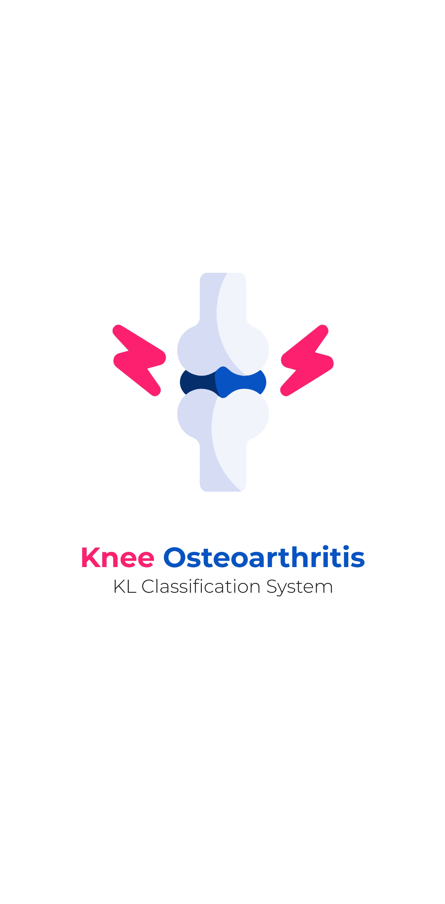
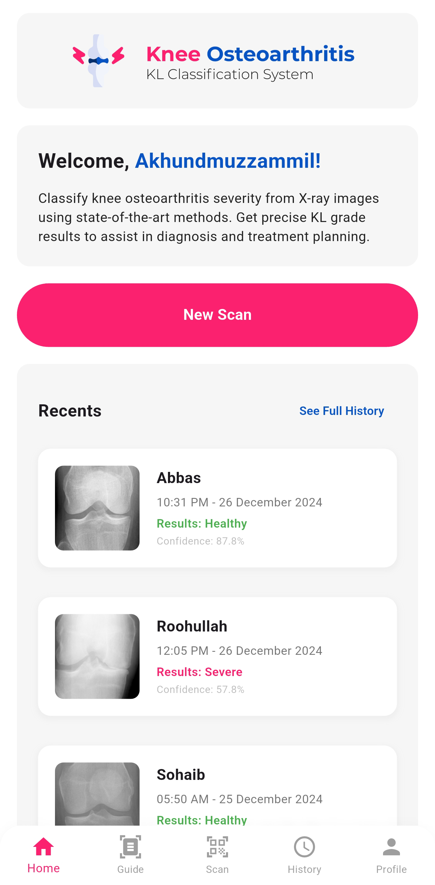
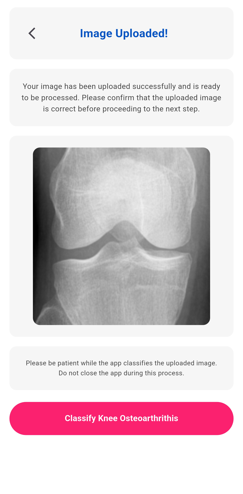
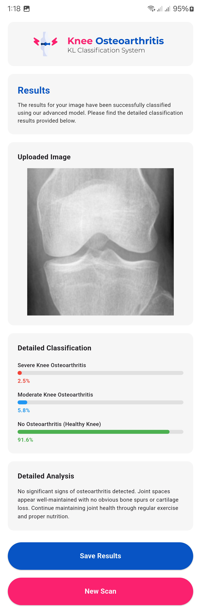
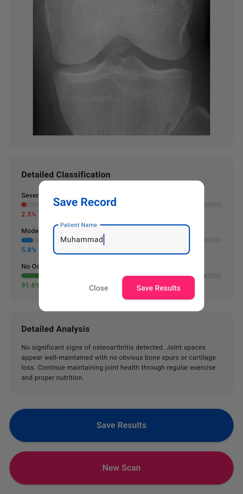
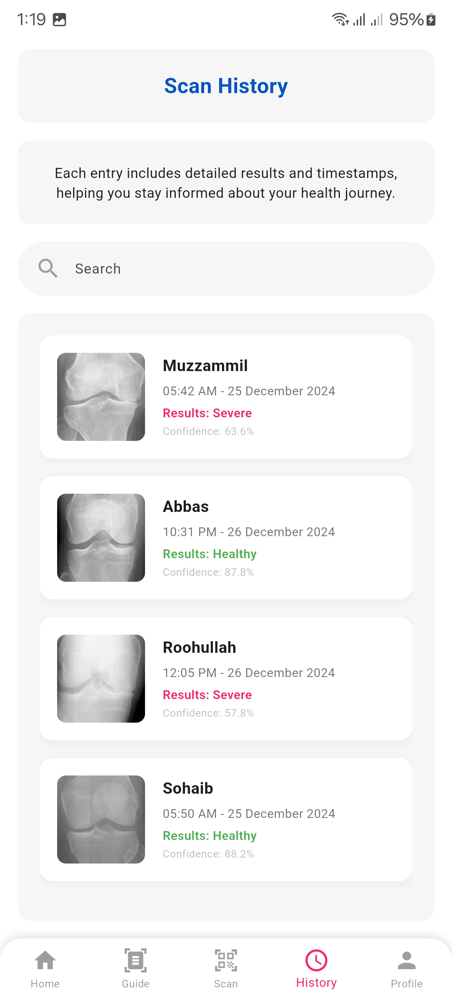
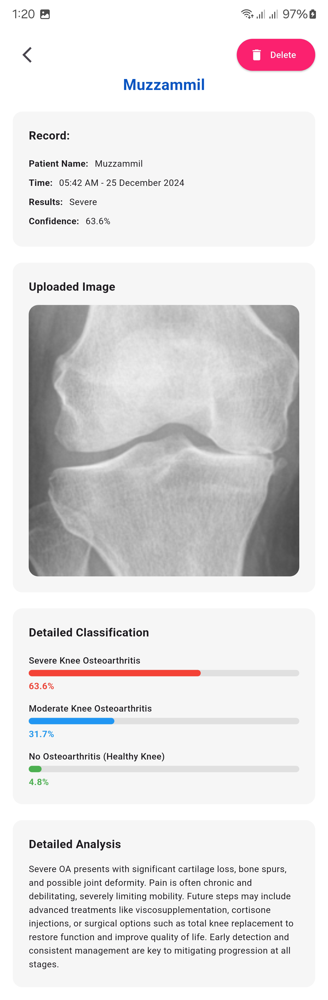
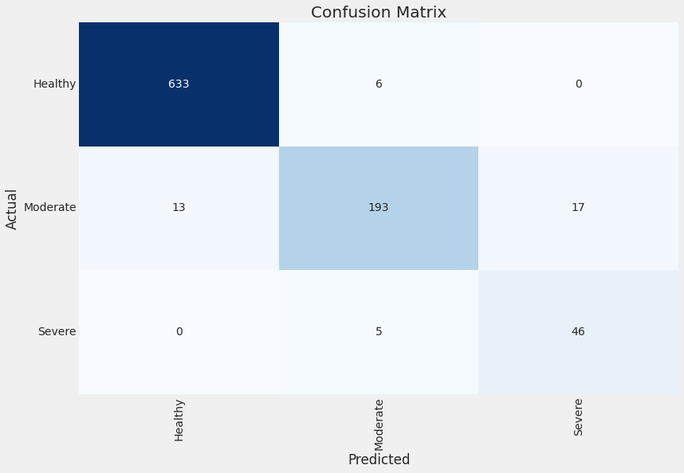
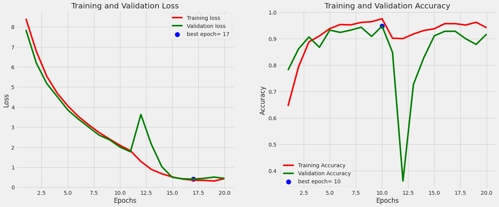
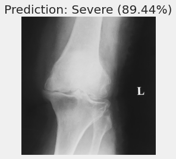

# Knee Osteoarthritis KL Classification

This project leverages deep learning to classify knee osteoarthritis severity using the Kellgren-Lawrence (KL) grading system, based on X-ray images. The classification is simplified to three classes (Healthy, Moderate, Severe) to streamline predictions and reduce complexity, focusing on practical clinical application.

### Project Overview
Knee osteoarthritis is a common, degenerative condition affecting the knee joint's articular cartilage. The breakdown of cartilage leads to joint friction, impact on bones, and inflammation of surrounding tissues, causing pain and restricting movement. The Kellgren-Lawrence (KL) grading system is widely used for evaluating osteoarthritis severity, ranging from Grade 0 (Healthy) to Grade 4 (Severe). This classification aids in determining treatment plans, predicting disease progression, and assessing clinical outcomes. 

Our model automates KL grading by analyzing X-ray images to classify knees into three primary categories:
- **Healthy**: No signs of osteoarthritis.
- **Moderate**: Noticeable joint space narrowing and cartilage damage.
- **Severe**: Advanced damage with significant cartilage loss and possible joint deformity.

### Screenshots
View the application interface and results:

<div align="center">
  
  
  
  
  
  
</div>

<div align="center">
  
  
  
  
  
  
</div>

### Model Architecture
This model uses **EfficientNetB5** as the backbone architecture due to its efficiency and proven success in medical imaging tasks. EfficientNetB5 optimizes performance and accuracy while managing computational complexity, making it ideal for high-resolution X-ray images.

## Dataset
The dataset consists of X-ray images sourced from [OAI](https://nda.nih.gov/oai) and is available at [Mendeley Data](https://data.mendeley.com/datasets/56rmx5bjcr/1) by Chen, Pingjun. It includes KL grading for each image, where:
- **Grade 0**: Healthy knee.
- **Grade 1 (Doubtful)**: Possible osteophyte and joint narrowing.
- **Grade 2 (Minimal)**: Definite osteophytes with potential narrowing.
- **Grade 3 (Moderate)**: Multiple osteophytes, mild sclerosis.
- **Grade 4 (Severe)**: Large osteophytes, severe sclerosis, significant narrowing.

*Note*: This project consolidates these into three simplified classes (Healthy, Moderate, Severe) to improve classification performance.

### Key Results
The model achieves an accuracy of **95%** on the validation dataset, showcasing its reliability in distinguishing knee osteoarthritis severity levels. Detailed metrics, including accuracy, F1-score, and confusion matrix, are available below.

## Installation

1. **Clone the repository**:
   ```bash
   git clone https://github.com/abdurrehman022/KOASystem.git
   cd KOASystem
   ```

2. **Install dependencies**:
   Use Python 3.9 and install main libraries like TensorFlow, Keras, and OpenCV as listed in `requirements.txt`.
   ```bash
   pip install -r requirements.txt
   ```

3. **Download the Dataset**:
   Download the dataset from [Kaggle](https://www.kaggle.com/code/abdurrehman022/knee-osteoarthritis-efficientnetb5-95-accuracy) or [Mendeley Data](https://data.mendeley.com/datasets/56rmx5bjcr/1), and place it in the `data/` directory.

4. **Download the Pre-trained Model**:
   Add your trained model (`kneeosteoarthritis_957.28.h5`) in the `models/` directory.

## Usage

### 1. Training
Train the model using the Jupyter notebook provided:
- `notebooks/knee-osteoarthritis-efficientnetb5-95-accuracy.ipynb`: This notebook contains the full training process, hyperparameter tuning, and evaluation.

#### Key Training Parameters
- **Learning Rate**: 0.001
- **Batch Size**: 32
- **Image Size**: 224x224
- **Epochs**: 25 (default)
*Modify these parameters in the notebook as needed.*

Training was conducted on a **T4 GPU** on Kaggle. Users can also run it on any system with GPU support for TensorFlow.

### 2. Inference
Use `inference.ipynb` for testing a single image:

```python
# Inference example
from inference import predict_single_image
prediction, confidence = predict_single_image('/path/to/image.png')
print(f"Prediction: {prediction} with {confidence:.2f}% confidence")
```

#### Input and Preprocessing
1. **Input**: A knee X-ray image in PNG or JPG format.
2. **Preprocessing**: Images are resized to 224x224 pixels, converted to RGB, and normalized using EfficientNet's preprocess function.

#### Output
- **Predicted Class**: One of the three classes (Healthy, Moderate, Severe).
- **Confidence Score**: Percentage representing the confidence in prediction.

### 3. Evaluation and Results
The model achieves an impressive accuracy of **95%** on the validation set. Key evaluation metrics, including accuracy, F1-score, precision, recall, and confusion matrix, can be found below. Plots showing the loss and accuracy over epochs, along with sample predictions, are also included.

Here's the updated **Evaluations and Results** section with separate headings:

### Evaluations and Results

#### Confusion Matrix
The confusion matrix below illustrates the model's performance across the three classes (Healthy, Moderate, Severe). This visualization helps identify areas where the model performs well and where it may require further tuning.



#### Loss and Accuracy Graph
The graph displays the training and validation loss and accuracy over epochs, indicating the model's learning progression and generalization capability. It highlights how well the model fits the data and whether any overfitting or underfitting is present.



#### Sample Prediction Output
This example prediction showcases the model's classification abilities, providing the predicted class and confidence score for a sample knee X-ray image.



## Flask API

An API is provided for deployment, allowing users to upload X-ray images and receive classification results.

#### Endpoints
- **`POST /predict`**: Upload an image to receive a prediction and confidence score.
   - **Input**: An image file in form-data format.
   - **Output**: JSON response with the predicted class and confidence level.

#### Example Request
```python
# Example request using Python
import requests

url = 'http://localhost:8000/predict'
image_path = '/path/to/image.png'
files = {'file': open(image_path, 'rb')}
response = requests.post(url, files=files)
print(response.json())
```

## Linked Repositories
- **[Flask API Repository](https://github.com/abdurrehman022/KOASystemAPI)**: Backend API implementation for the KOA Classification System
- **[Flutter App Repository](https://github.com/sohaibkhan209/KOASystemFlutter)**: Mobile application for the KOA Classification System

## Future Work
Our future development plans focus on expanding the system's capabilities:

1. **Local Dataset Integration**: Working with local healthcare providers to collect and analyze region-specific knee osteoarthritis datasets to improve model accuracy for local populations.

2. **Extended Disease Coverage**: Expanding the system's capabilities to classify other musculoskeletal conditions and diseases, leveraging the experience and architecture developed for knee osteoarthritis classification.

## License

This project is licensed under the MIT License - see the [LICENSE](LICENSE) file for details.
